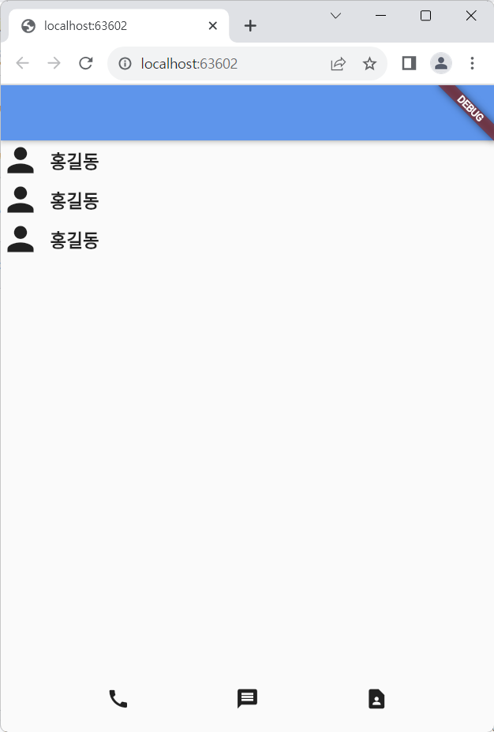

# Flutter : 6강 과제

이 코드는 Flutter로 dart 언어이며, '쉽게알려주는 플러터 강의임-코딩애플'의 6강 과제입니다.
전화번호부 화면을 카피하였으며, 커스텀 위젯을 활용했습니다.

**수정 내용**
- Profile() 커스텀 위젯 추가 및 사용

## 앱 스크린샷



## 코드 예제

#### 과제 완료 코드
[6강 과제 코드_완료 보러 가기](./_6강과제.dart)
```dart
import 'package:flutter/material.dart';

void main() {
  runApp( const MyApp());
}

class MyApp extends StatelessWidget {
  const MyApp({Key? key}) : super(key: key);

  @override
  Widget build(BuildContext context) {

    return MaterialApp(
      home: Scaffold(
        appBar: AppBar(),
        body: ListView(
          children: [
            Row(
              children: [
                Icon(Icons.person, size: 40,),
                SizedBox(width: 10,),
                Text('홍길동', style: TextStyle(fontSize: 18, fontWeight: FontWeight.bold),),
              ],
            ),
            Row(
              children: [
                Icon(Icons.person, size: 40,),
                SizedBox(width: 10,),
                Text('홍길동', style: TextStyle(fontSize: 18, fontWeight: FontWeight.bold),),
              ],
            ),
            Row(
              children: [
                Icon(Icons.person, size: 40,),
                SizedBox(width: 10,),
                Text('홍길동', style: TextStyle(fontSize: 18, fontWeight: FontWeight.bold),),
              ],
            ),
          ],
        ),
        bottomNavigationBar: CallBottomAppBar(),
      ),
    );
  }
}

class CallBottomAppBar extends StatelessWidget {
  const CallBottomAppBar({super.key});

  @override
  Widget build(BuildContext context) {
    return Container(
      height: 70,
      child: Row(
        mainAxisAlignment: MainAxisAlignment.spaceEvenly,
        children: [
          Icon(Icons.call),
          Icon(Icons.message),
          Icon(Icons.contact_page),
        ],
      ),
    );
  }
}
```

## 앱 스크린샷

**화면은 이전과 동일**

#### 추가 기능 구현
[6강 과제 코드_추가 기능 보러 가기](./수정_6강과제.dart)
```dart
//코드 생략 ...

  Widget build(BuildContext context) {

    return MaterialApp(
      home: Scaffold(
        appBar: AppBar(),
        body: ListView(
          children: [
            Profile(),
            Profile(),
            Profile(),
          ],
        ),
        bottomNavigationBar: CallBottomAppBar(),
      ),
    );
  }
}

class Profile extends StatelessWidget {
  const Profile({super.key});

  @override
  Widget build(BuildContext context) {
    return Row(
      children: [
        Icon(Icons.person, size: 40,),
        SizedBox(width: 10,),
        Text('홍길동', style: TextStyle(fontSize: 18, fontWeight: FontWeight.bold),),
      ],
    );
  }
}

//코드 생략 ...

```
