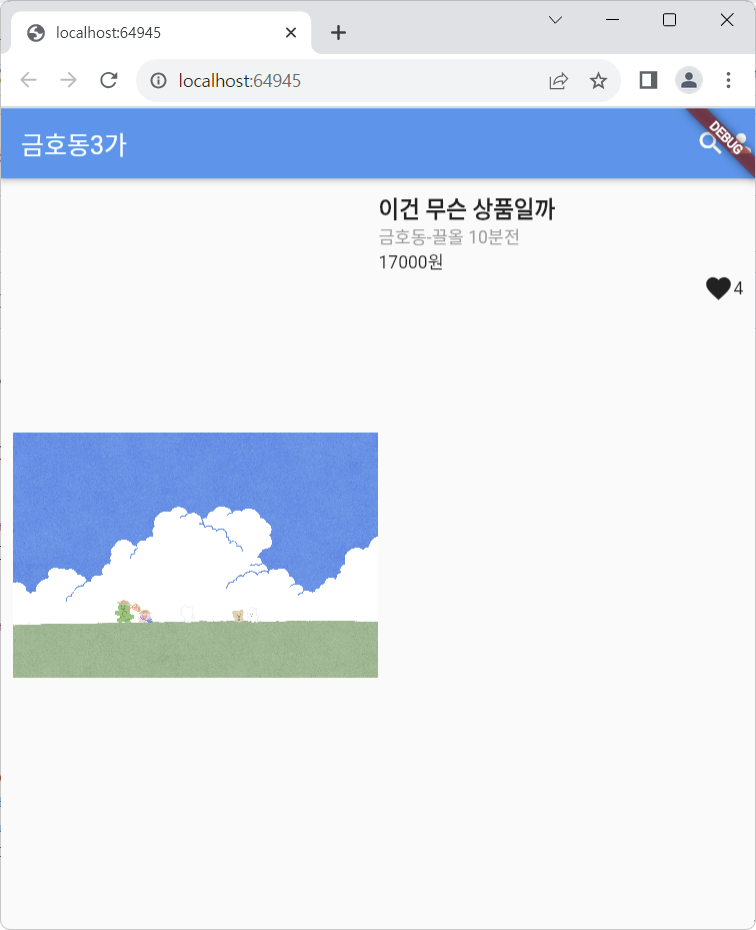

# Flutter : 4강 과제

이 코드는 Flutter로 dart 언어이며, '쉽게알려주는 플러터 강의임-코딩애플'의 4강 과제입니다.
당근마켓의 구조를 카피하였으며, 간단한 상품 정보 Container 1개를 화면에 표시합니다.

## 앱 스크린샷



## 코드 예제

[4강 과제 코드 보러 가기](./_4강과제.dart)
```dart
import 'package:flutter/material.dart';

void main() {
  runApp(const MyApp());
}

class MyApp extends StatelessWidget {
  const MyApp({Key? key}) : super(key: key);

  @override
  Widget build(BuildContext context) {
    return MaterialApp(
      home: Scaffold(
        appBar: AppBar(
          title: Text("금호동3가"),
          leading: Row(
            children: [
              Icon(Icons.search),
              Icon(Icons.person),
            ],
          ),
        ),
        body: Container(
          padding: EdgeInsets.all(10),
          child: Row(
            children: [
              Expanded(
                child: Image.asset('assets/Kimmiimyo.jpg', width: 150,),
              ),
              Expanded(
                child: Container(
                  width: double.infinity,
                  child: Column(
                    crossAxisAlignment: CrossAxisAlignment.start,
                    children: [
                      Text('이건 무슨 상품일까', style: TextStyle(fontSize: 18, fontWeight: FontWeight.bold),),
                      Text('금호동-끌올 10분전',style: TextStyle(color: Colors.grey),),
                      Text('₩17,000', style: TextStyle(color: Colors.green, fontSize: 16, fontWeight: FontWeight.bold),),
                      Row(
                        mainAxisAlignment: MainAxisAlignment.end,
                        children: [
                          Icon(Icons.favorite),
                          Text('4')
                        ],
                      )
                    ],
                  ),
                ),
              ),
            ],
          ),
        ),
      ),
    );
  }
}
